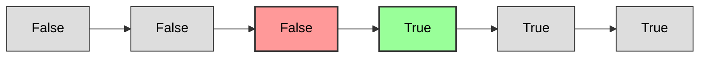

# Binary Search — A Complete Masterclass

This is not a list of code snippets to copy. It's a systematic method for *deriving* the correct Binary Search logic for any problem from first principles. Every section follows the same ten-step lens:

1. **How to recognize Binary Search applies**
2. **How to choose the search space**
3. **Why that search space (and not another)**
4. **How to define the loop condition**
5. **How to compute mid without overflow**
6. **How to write the decision (`check`) function**
7. **How to update the boundaries (`low`, `high`)**
8. **How to prevent infinite loops (The "Two Elements Left" test)**
9. **How to identify the correct return value**
10. **The general pattern this problem represents**

---

## PART 0 — The Monotonicity Lens

The absolute most common mistake beginners make is assuming Binary Search only works on **sorted arrays**. In reality, Binary Search works on any problem that possesses **monotonicity**.

A problem has monotonicity if we can define a decision function `check(x)` that returns a boolean (`True`/`False`), such that the output sequence over the search space looks like this:

$$\text{False, False, False, ..., False, True, True, True, ..., True}$$
$$\text{or}$$
$$\text{True, True, True, ..., True, False, False, False, ..., False}$$

Once the state switches from `False` to `True` (or vice-versa), it **never switches back**. 



Binary Search is the process of finding the **exact boundary** where this switch occurs. If you can prove that your search space is partitioned into a `False` zone and a `True` zone, you can apply Binary Search.

---

## PART 1 — Foundations: Classic Index-Based Binary Search

> Given a sorted array `arr` and a `target`, find the index of `target`. If it doesn't exist, return `-1`.

Let's apply the 10-step lens to this foundational problem:

**1. Recognition.** The array is sorted. If `arr[mid] < target`, then for all `i < mid`, `arr[i]` is also strictly less than `target`. We can eliminate the entire left half. This is monotonicity in its simplest form.

**2/3. Search Space.** The index range of the array: `[0, n - 1]`.
* **Why this space?** The target, if it exists, must reside within the valid bounds of the array. The search space represents "all remaining candidate indices."

**4. Loop Condition.** We use `while low <= high`.
* **Why?** Since we are searching for an *exact* match, the target could be at the very last remaining element when `low == high`. We must enter the loop in this state to check it.

**5. Mid Calculation.** 
```python
mid = low + (high - low) // 2
```
* **Why?** Writing `(low + high) // 2` is vulnerable to integer overflow in languages with fixed-width integers (like C++, Java, or Go) if the sum exceeds $2^{31} - 1$. The subtraction-based formulation `low + (high - low) // 2` is mathematically equivalent but guarantees no overflow.

**6. Decision Function.**
Direct comparison: is `arr[mid] == target`? If yes, we found our answer immediately.

**7. Boundary Updates.**
* If `arr[mid] < target`: The target is strictly greater. Since the array is sorted, it cannot be at `mid` or any index to its left. Thus, we eliminate `[low, mid]` by setting `low = mid + 1`.
* If `arr[mid] > target`: The target is strictly smaller. It cannot be at `mid` or any index to its right. We eliminate `[mid, high]` by setting `high = mid - 1`.

```python
if arr[mid] == target:
    return mid
elif arr[mid] < target:
    low = mid + 1
else:
    high = mid - 1
```

**8. Infinite Loop Prevention.** Since both updates branch to `mid + 1` or `mid - 1`, the search space strictly shrinks by at least 1 element on every iteration. Thus, it is impossible to get stuck in an infinite loop.

**9. Return Value.** If the loop terminates without finding a match, the target does not exist. Return `-1`.

**10. Pattern Name:** **Classic Target Match.**

---

## PART 2 — Leftmost and Rightmost Insertion (Lower & Upper Bounds)

This is where Binary Search gets subtle. Often, we don't want an exact match; we want to find the boundary of a range (e.g., the first occurrence of a duplicate, or the insertion point).

### Lower Bound (First occurrence of element $\ge$ target)
> Find the smallest index `i` such that `arr[i] >= target`. If all elements are smaller, return `n`.

**1. Recognition.** The condition `arr[i] >= target` yields a monotonic sequence:
* For indices where `arr[i] < target`, the predicate is `False`.
* For indices where `arr[i] >= target`, the predicate is `True`.
* We want to find the **first `True`**.

**2/3. Search Space.** `low = 0`, `high = n - 1`. We also initialize an auxiliary variable `ans = n`.
* **Why?** If no element satisfies the condition, the answer defaults to `n` (the size of the array).

**4. Loop Condition.** We use `while low <= high`.
* **Why?** It keeps the state machine simple. We traverse the entire space until `low` and `high` cross, updating our candidate `ans` whenever we find a valid index.

**6/7. Decision and Updates.**
* If `arr[mid] >= target`: This is a valid candidate! We record it (`ans = mid`). However, we want the *smallest* index. A smaller valid index might exist to the left. So we search the left half: `high = mid - 1`.
* If `arr[mid] < target`: This is invalid. `mid` and everything to its left cannot be the answer. We search the right half: `low = mid + 1`.

```python
def lower_bound(arr, target):
    low, high = 0, len(arr) - 1
    ans = len(arr)
    while low <= high:
        mid = low + (high - low) // 2
        if arr[mid] >= target:
            ans = mid
            high = mid - 1  # Try to find a smaller index on the left
        else:
            low = mid + 1   # Force search to the right
    return ans
```

**8. Infinite Loop Prevention.** Every branch moves the boundaries past `mid` (`mid - 1` and `mid + 1`), ensuring termination.

---

## PART 3 — The Two Core Templates

To write bug-free Binary Search, you should master two clean templates. Both are powerful, but they handle boundary conditions differently.

### Template 1: The "Best Answer Record" (Pointer Crossing)
This is the most intuitive template for beginners. You maintain an explicit `ans` variable and shrink the search space past `mid` in all branches.

```python
# General structure for finding a boundary
low = MIN_POSSIBLE_VALUE
high = MAX_POSSIBLE_VALUE
ans = DEFAULT_VALUE

while low <= high:
    mid = low + (high - low) // 2
    if check(mid):
        ans = mid          # Record the candidate
        # For finding the FIRST True: search left
        high = mid - 1 
        # For finding the LAST True: search right
        # low = mid + 1
    else:
        # If check failed and we wanted True:
        # we must move search to the other half
        low = mid + 1      # (or high = mid - 1, depending on monotonicity)
```
* **Pros:** Extremely safe. Since boundaries always move past `mid` (`mid - 1` or `mid + 1`), you can **never** hit an infinite loop.
* **Cons:** Requires managing the extra `ans` state.

---

### Template 2: The "Collapsing Window" (`low < high`)
This template collapses the interval directly onto the target element. No extra `ans` variable is used. When the loop terminates, `low == high`.

```python
# Finding the FIRST index where check(index) is True
low = 0
high = n - 1 # or n depending on search space

while low < high:
    mid = low + (high - low) // 2
    if check(mid):
        high = mid     # mid is a candidate, don't discard it!
    else:
        low = mid + 1  # mid is not a candidate, discard it.
        
# Termination: low == high. You must do a final check if the answer is guaranteed or not.
return low
```

> [!WARNING]
> **The Infinite Loop Trap**
> If you write Template 2, you MUST align your `mid` calculation with your updates. 
> If your update uses `low = mid`, a naive left-leaning mid `low + (high - low) // 2` will cause an infinite loop when `high - low == 1`.

Let's dissect this trap.

---

## PART 4 — The "Two Elements Left" Test (Avoiding Infinite Loops)

Whenever you design a Binary Search where one of the updates is `low = mid` or `high = mid`, you must trace the execution with exactly **two elements left** (i.e., `high = low + 1`).

Let's test both configurations:

### Configuration A: Left-leaning Mid, updating `low = mid`
* **State:** `low = 0`, `high = 1`.
* **Mid calculation:** `mid = 0 + (1 - 0) // 2 = 0`.
* **Branch execution:** Suppose the condition is met and we execute `low = mid`.
* **Result:** `low` remains `0`. The loop restarts with `low = 0, high = 1`. **Infinite Loop!**

### Configuration B: Right-leaning Mid, updating `low = mid`
* **State:** `low = 0`, `high = 1`.
* **Mid calculation (Right-leaning):** `mid = low + (high - low + 1) // 2` $\rightarrow$ `0 + (1 - 0 + 1) // 2 = 1`.
* **Branch execution:** We execute `low = mid` $\rightarrow$ `low = 1`.
* **Result:** `low` becomes `1`. The loop condition `low < high` (`1 < 1`) fails, and the loop terminates safely.

### The Golden Rule of Pointer Updates:
* If your update contains `low = mid + 1` and `high = mid` $\rightarrow$ use **left-leaning mid** (standard):
  ```python
  mid = low + (high - low) // 2
  ```
* If your update contains `low = mid` and `high = mid - 1` $\rightarrow$ use **right-leaning mid**:
  ```python
  mid = low + (high - low + 1) // 2
  ```

---

## PART 5 — Binary Search on Answer Space (BSA)

This is the ultimate application of Binary Search in technical interviews. You are not searching an array; you are searching a range of integers representing the **value of the answer itself**.

### How to recognize BSA:
1. The problem asks you to **maximize the minimum** or **minimize the maximum** of some quantity.
2. If you are given a candidate answer `X`, you can easily write a greedy function `check(X)` in $O(N)$ time to determine if `X` is feasible.
3. If `X` is feasible, then all values greater than `X` (or smaller than `X`) are also feasible (Monotonicity).

Let's master this by solving two classic optimization problems.

---

## PART 6 — BSA Case Study 1: Koko Eating Bananas

> There are `piles` of bananas, where the $i$-th pile has `piles[i]` bananas. Koko can choose an hourly eating speed `k`. She wants to eat all bananas within `h` hours. Find the **minimum** integer speed `k` such that she can eat all bananas.

Let's apply the 10-step lens:

**1. Recognition.** 
* If Koko eats at speed `k`, and can finish in time, she can also finish at any speed `y > k`.
* If she cannot finish at speed `k`, she cannot finish at any speed `y < k`.
* This yields a monotonic sequence: `[False, False, ..., True, True]`. We want the **first `True`** (minimum speed).

**2/3. Search Space.**
* What is the absolute minimum speed possible? `low = 1` banana/hour (she cannot eat 0 bananas/hour).
* What is the absolute maximum speed she would ever need? `high = max(piles)` (eating more than the largest pile in one hour doesn't save any additional hours because she can only eat from one pile per hour).
* **Why this space?** The optimal speed `k` must lie in `[1, max(piles)]`.

**4. Loop Condition.**
Let's use **Template 1** (Pointer Crossing with `ans` variable) because it is highly readable and immune to infinite loops.
```python
while low <= high:
```

**5. Mid Calculation.**
`mid = low + (high - low) // 2`

**6. Decision Function (`check(k)`).**
Can Koko finish all piles within `h` hours at speed `k`?
For each pile, the hours needed is $\lceil \text{pile} / k \rceil$, which is mathematically calculated as `(pile + k - 1) // k`.
```python
def check(k):
    hours = 0
    for pile in piles:
        hours += (pile + k - 1) // k
    return hours <= h
```

**7. Boundary Updates.**
* If `check(mid)` is `True`: `mid` is a valid speed. We record it (`ans = mid`) and try to find a slower speed by searching the left half: `high = mid - 1`.
* If `check(mid)` is `False`: `mid` is too slow. We must search the right half: `low = mid + 1`.

```python
class Solution:
    def minEatingSpeed(self, piles: list[int], h: int) -> int:
        low = 1
        high = max(piles)
        ans = high
        
        while low <= high:
            mid = low + (high - low) // 2
            
            # Greedy check function
            hours_needed = 0
            for pile in piles:
                hours_needed += (pile + mid - 1) // mid
                
            if hours_needed <= h:
                ans = mid
                high = mid - 1  # Try to find a smaller speed on the left
            else:
                low = mid + 1   # Speed is too slow, increase it
                
        return ans
```

---

## PART 7 — BSA Case Study 2: Capacity To Ship Packages Within D Days

> A conveyor belt has packages with weights. We must ship them within `days` days. We cannot split packages, and we must ship them in the order given. Find the **minimum** weight capacity of the ship.

Let's apply the 10-step lens:

**1. Recognition.** 
* If capacity `C` can ship all packages within `days`, any capacity `y > C` can also do it.
* If capacity `C` cannot ship them, any capacity `y < C` will also fail.
* Monotonicity: `[False, False, ..., True, True]`. We want the **first `True`**.

**2/3. Search Space.**
* **What is the absolute minimum capacity?** The heaviest package: `low = max(weights)`. (If capacity is less than the heaviest package, we can never ship that package).
* **What is the absolute maximum capacity?** The sum of all packages: `high = sum(weights)`. (If we have this capacity, we can ship all packages on day 1).
* **Why this space?** The answer is mathematically guaranteed to be in `[max(weights), sum(weights)]`.

**6. Decision Function (`check(capacity)`).**
Iterate through the packages and group them into days greedily. If the current package exceeds our running day sum, we push it to the next day.
```python
def check(capacity):
    days_needed = 1
    current_weight = 0
    for w in weights:
        if current_weight + w > capacity:
            days_needed += 1
            current_weight = w
        else:
            current_weight += w
    return days_needed <= days
```

**7. Boundary Updates.**
* If `check(mid)` is `True`: `mid` is a valid capacity. Record it (`ans = mid`) and try to minimize it: `high = mid - 1`.
* If `check(mid)` is `False`: `mid` is too small. Increase capacity: `low = mid + 1`.

```python
class Solution:
    def shipWithinDays(self, weights: list[int], days: int) -> int:
        low = max(weights)
        high = sum(weights)
        ans = high
        
        while low <= high:
            mid = low + (high - low) // 2
            
            # Greedy check
            days_needed = 1
            current_weight = 0
            for w in weights:
                if current_weight + w > mid:
                    days_needed += 1
                    current_weight = w
                else:
                    current_weight += w
                    
            if days_needed <= days:
                ans = mid
                high = mid - 1  # Minimize capacity
            else:
                low = mid + 1   # Increase capacity
                
        return ans
```

---

## PART 8 — BSA Case Study 3: Aggressive Cows (Maximize Minimum Distance)

> Given `N` stalls at coordinate positions, place `C` cows such that the **minimum distance** between any two cows is as **large as possible**. Return this maximum minimum distance.

This is a **maximizing the minimum** problem. Let's trace it:

**1. Recognition.** 
* If we can place cows such that the minimum distance between them is at least `d`, we can definitely do it for any distance `y < d`.
* If we cannot place them with min distance `d`, we cannot do it for any distance `y > d`.
* Monotonicity: `[True, True, ..., False, False]`. We want the **last `True`** (maximum distance).

**2/3. Search Space.**
* Stalls must be sorted first to make greedy placement possible.
* `low = 1` (minimum possible distance between cows).
* `high = stalls[-1] - stalls[0]` (maximum possible distance between cows at extreme ends).
* **Why this space?** Any valid minimum distance must lie within these geometric limits.

**6. Decision Function (`check(d)`).**
Can we place `C` cows such that every adjacent placed cow has a distance $\ge d$?
Place the first cow at `stalls[0]`. Iterate through stalls and place the next cow as soon as the distance from the last placed cow is $\ge d$.
```python
def check(d):
    count = 1
    last_placed = stalls[0]
    for i in range(1, len(stalls)):
        if stalls[i] - last_placed >= d:
            count += 1
            last_placed = stalls[i]
            if count >= C:
                return True
    return False
```

**7. Boundary Updates.**
* If `check(mid)` is `True`: `mid` is valid. Record it (`ans = mid`). We want to *maximize* this distance, so we try to find a larger valid distance in the right half: `low = mid + 1`.
* If `check(mid)` is `False`: `mid` is too large. We must decrease our target distance: `high = mid - 1`.

```python
def aggressive_cows(stalls, C):
    stalls.sort()
    low = 1
    high = stalls[-1] - stalls[0]
    ans = 1
    
    while low <= high:
        mid = low + (high - low) // 2
        
        # Greedy placement check
        count = 1
        last_placed = stalls[0]
        for i in range(1, len(stalls)):
            if stalls[i] - last_placed >= mid:
                count += 1
                last_placed = stalls[i]
        
        if count >= C:
            ans = mid
            low = mid + 1  # Try to maximize the minimum distance
        else:
            high = mid - 1 # Distance is too large, reduce it
            
    return ans
```

---

## PART 9 — Floating-Point Binary Search

Sometimes, we need to find a value that is a real number (float) rather than an integer (e.g., finding square roots, or solving geometric/physical equations).

### Key Differences:
1. There are no integers, so `mid + 1` or `mid - 1` are invalid. We must use `low = mid` and `high = mid`.
2. The loop condition `low <= high` or `low < high` is dangerous due to precision limits. Instead, we run the loop for a **fixed number of iterations** (usually 100), or check if `high - low > epsilon` (where epsilon is the desired precision, e.g., $10^{-7}$).

```python
# Finding square root of x
low = 0.0
high = x
epsilon = 1e-7

# Running 100 iterations reduces the search space by 2^100,
# which is far beyond standard double-precision limit.
for _ in range(100):
    mid = low + (high - low) / 2
    if mid * mid <= x:
        low = mid
    else:
        high = mid

return low
```

---

## PART 10 — Self-Test Challenge

To solidify your understanding, apply the 10-step lens to these problems:

1. **Find Peak Element** (Leetcode 162): The array is not sorted, but does it have local monotonicity? How do we discard half?
2. **Search in Rotated Sorted Array** (Leetcode 33): How does the rotation split the search space into two monotonic segments, and how do we decide which one `mid` lies in?
3. **Split Array Largest Sum / Book Allocation** (Leetcode 410): Why is this identical to the "Capacity to Ship Packages" problem?
4. **Median of Two Sorted Arrays** (Leetcode 4): How do we binary search on the partition index of the smaller array?

---

*This masterclass is a conceptual framework. Do not memorize templates. Instead, look for monotonicity, define your search space carefully, test your pointer updates with two elements left, and verify your base case transitions.*
